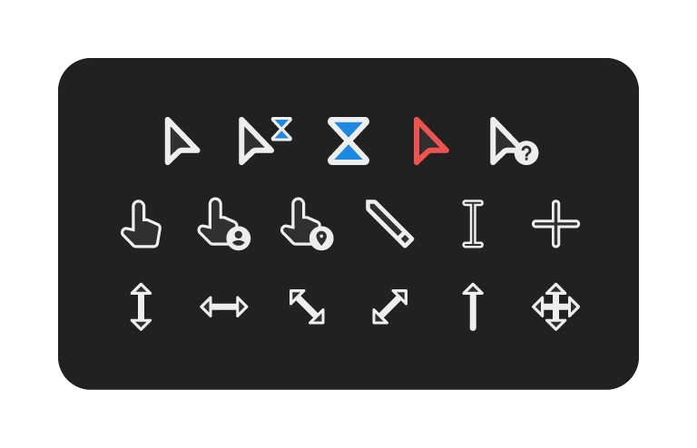
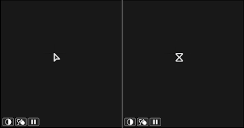

# Material Design Cursors (Canary)

_Project status: In progress..._



Cursors in Material Design style. Light and dark theme. There are three sizes to choose from: regular (as medium), XL (large) и XXL (very large)

Only two states are animated - "busy" and "work".
<details><summary>(click to open demo)</summary>
  

**This is just a preview. Looks better in practice.
</details>
The remaining states are static.

# Gratitude

**Thanks [**jepricreations**](https://www.deviantart.com/jepricreations) (aka **rosea92**) for the idea in the original arts.**

# License
```
Read the "LICENSE" file.
```
