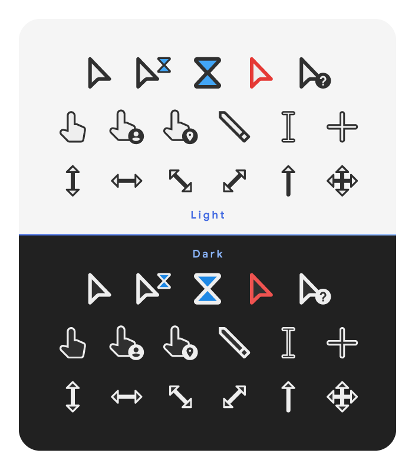

# Material Design Cursors

Windows cursors in Material Design style. Light and dark theme. There are three sizes to choose from: regular (as medium), XL (large) и XXL (very large).

## What's included in the package?
There are all variations available for Windows. They are all static. _I gave up on animating due to the high degree of tediousness (6 cursors, each 51 frames = 306 times I need to manually render rasters – it's hard). Thank you for reminding._

## Install
1. In the root directory with the required cursors, the file **install.inf**;
2. Right mouse button and “Install”;
3. Make sure that the set of cursors to be installed is selected in the list of schemes. If desired, set checkbox “Add a pointer shadow”. And click “OK”;
4. To the question “Replace the scheme?” - agree;
5. Now the new cursors work.

## Uninstall
If you suddenly want to delete these cursors, then in the mouse pointer settings, delete the installed scheme. Also delete the directory named **Material** in the `C:\Windows\Cursors\` directory.

# Gratitude

**Thanks [**jepricreations**](https://www.deviantart.com/jepricreations) (aka **rosea92**) for the idea in the original arts.**

# License
```
Read the "LICENSE" file.
```
